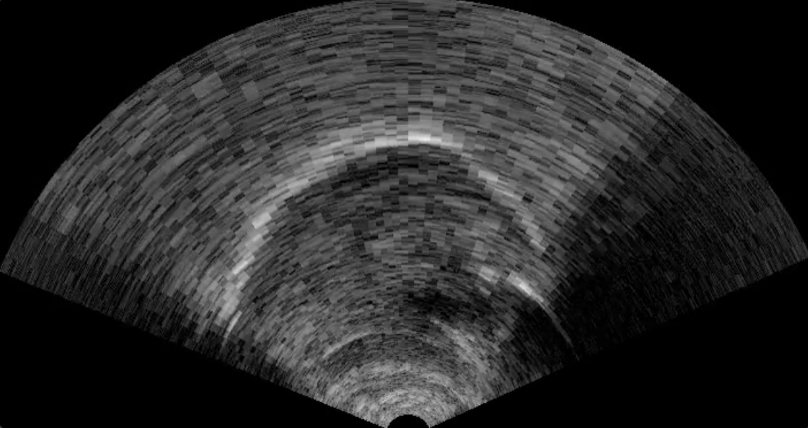

% Getting started; features
% Matthew Faytak University at Buffalo NTU lecture series
%   

# About me

## About me

Matthew Faytak [ˈfeɪˌtæk], Assistant Professor in Linguistics at the University at Buffalo (State Univ. of New York) since mid-2021

*   PhD UC Berkeley 2018
*   Postdoc UCLA 2018-2021

Pronouns he, they, 他

## About me

My expertise is in articulatory phonetics

*   Specialization in ultrasound tongue imaging
*   I have worked on languages of China and Cameroon, plus English and French
*   I can use French and Standard Chinese
	* ... just not well enough to give this lecture in

Additional interests in phonetic typology, sound change, and phonological structure

# The format of these lectures

## Slidy slides

These lecture slides are hosted in HTML format on my personal site

* Displays slide by slide by default; use arrow keys or click to navigate
* "C" key displays table of contents
* "A" key shows all slides in order
* "P" key prints slides

Each linked by a QR code (see title slide)

## Python notebooks

Two notebooks running Python 3.x hosted on Google CoLab are provided for demo purposes

* Lectures will include a walk-through of each notebook
* Demonstrate how to *implement* concepts discussed in the lectures

## Annotations

We will highlight key terms **like this**

Emphasis looks *like this*

We will cover Python code, and when presented in slides it will look `like_this()`

In-text references are included as small text Like & This (1980)

In-text external links look <a href="https://www.youtube.com/watch?v=dQw4w9WgXcQ">like this</a>

# About this course

## About this course

Two main areas: 

* Ultrasound as a tool for phonetics and speech science 
* **Dimensionality reduction** as one of several ways of handling ultrasound data
	* Taking many dimensions (whole image) and producing simpler numerical measures

Helps us to solve a conundrum:

* Ultrasound is non-invasive, well-suited to field situations, relatively inexpensive and speaker-friendly
* ... but creates very complex, noisy data, which normally requires labor-intensive post-processing

## About this course

Specific topics covered will include:

* **Features** in acoustic and articulatory phonetics analysis 
* **Feature selection** and **feature extraction** in phonetics
* Dimensionality reduction as a type of feature extraction
* Ultrasound data and typical processing methods
* **Eigentongue** method and derived methods

Interactive Python notebooks for:

* **Principal component analysis** of a linguistic data set
* Two case studies from my own work (on Shanghai Mandarin and Suzhou Wu)

## The rest of *this* lecture

**Features** and **feature selection** in phonetics (speech production)

* Major way we arrive at predictive features for research purposes
* Underlying research philosophies
* Limits and advantages of this approach

# Feature selection

## Features

Not meant in the phonological sense: a **feature** is a property of some phenomenon that can be measured Liu (2011)

* Observations of study phenomena are made in terms of their features
* We must know *which* features to observe when conducting research
* Cannot observe all simultaneously

## Feature selection

This process we undertake is **feature selection**: picking a subset of available features
Liu (2011)

* Often based on prior knowledge of the phenomenon
* A way to bring the number of features down to a reasonable level

Feature selection is labor-intensive but fundamental to science and engineering Guyon & Elisseeff (2003); Cai et al. (2018), with clear benefits for researchers:

* Improve performance of predictor variables, by selecting the right ones 
* Speed up computation and analysis to practical levels
* Develop a *theory-driven* understanding of the phenomenon being studied

## Feature selection in phonetics

The signal resulting from speech is complex and time varying, so phoneticians have long been concerned with questions of feature selection 

* Measure particular acoustic properties
* Measure certain aspects of articulation
* Record particular aspects of response to stimuli
* As opposed to offering *gestalt* impression of a recording

## Feature selection in phonetics

Some general criteria of a good feature in speech production research:

* Good performance against known categories (i.e. phonemic contrasts)
* Perceptual relevance
* Practical to measure

The challenge: figuring out what feature(s) to select

* Often takes years of research, as we will see

## Formants

Formants as a feature are intimately connected to the history of phonetics as a science figure from Peterson & Barney (1952)

## Formants

Usefulness established over a long time period

* Gradual refinement of interpretation of formants in terms of articulatory actions Hermann (1894, 1895); Russell (1929)
* Source-filter theory: clear physiological, articulatory correlates Chiba & Kajiyama (1941); Fant (1960)
* Formant transitions for consonants; variation; formants as *perceptually* relevant Potter & Peterson 1948; Peterson & Barney (1952)
* Bark scale (and others), for better mapping to perceptual space Zwicker (1961)

## Voice onset time

Perhaps the single most substantial example of a hand-picked feature  figure from Mikuteit & Reetz (2007)

## Voice onset time

Also developed over a number of years

* Coined in Lisker & Abramson (1964), after a synthesizer parameter which created the percept of (English) voiceless stops
* Built on years of research into parameters of linguistic plosive "voicing" contrasts Stetson (1951); Liberman, Delattre & Cooper (1952)

Characterizes laryngeal contrasts in a huge number of languages Cho & Ladefoged (1999)

# Feature pitfalls

## Non-optimal single features

Even these two very popular, very validated  features don't  extend well to *all* related speech phenomena, or can't characterize all related phonological contrasts

* In particular due to language to language variation, or even differences in how a contrastive property is coproduced on various segment types
* Sometimes a speech phenomenon does not have clear, easily extracted features in the acoustic signal

## Voice onset time

Certain dimensions of "voicing" contrast are not captured using voice onset time alone see Abramson & Whalen (2017)

* Voiced aspirated or breathy plosives Davis (1994), Mikuteit & Reetz (2007), Dmitrieva & Dutta (2020)
* Complex cues *including* VOT, but also $f0$ and voice quality in surrounding segments figure from Mikuteit & Reetz (2007)

* Preaspirated plosives Löfqvist & Yoshida (1981); Helgason & Ringen (2008)
* Tense-lax contrasts as in Otomanguean DiCanio (2012) or  Korean Cho et al. (2002)

## Nasality

Measuring the degree of nasality in vowels has long been a problem for phoneticians, since nasality may be signaled by a huge number of acoustic cues Styler (2017)

* Nasal formants and antiformants (Styler examines 13 features)
* Formant freqs and bandwidths
* Spectral tilt, due to more drop-off of high harmonics in nasals

Use of each property varies:

* Vowel-specific effects on formants Carignan (2018) ("counter-clockwise vowel shift")
* Language-specific acoustics Styler (2017)

## Phonation

Another case where simple measures have gradually been shown to be insufficient

* Traditional: basically one-dimensional, related to glottal opening Gordon & Ladefoged (2001)
* But recent study of more languages has shown that voice quality is clearly multi-dimensional Gerratt & Kreiman (2001);  Esposito & Khan (2020); Keating et al (n.d.), particularly in languages with many phonation types, i.e. !Xóõ Garellek (2019)

Ways to measure properties of phonation include: 

* Spectral tilt measures
* Formant amplitudes and bandwidths
* Electroglottograph measures (contact quotient, open quotient)

Different properties are useful in different languages Brunelle & Kirby (2016)

## Advanced tongue root

Perhaps one of the most difficult contrasts to capture acoustically; wide range of acoustic properties have been employed Fulop et al (1998); Kirkham & Nance (2017); Olejarczuk et al. (2019) 

* Frequency and bandwidth of F1
* Low harmonic amplitudes and derived measures
* Center of gravity; spectral tilt

Some reasons for acoustic variation:

* Underlying cavity shapes may vary from language to language Kirkham & Nance (2017)
* Some languages recruit voice quality differences to support Edmonson & Esling (2006); Guion et al. (2008); Olejarczuk et al. (2019)

# Feature selection: discussion

## Advantages

Feature selection is the usual way of working, and it is popular for good reasons

* *Ease* of use: simple numerical measures are easy to collect and process, which non-trivially makes replication easier
	* Experimental design is easier, since we know the specific, small number of features to focus on
	* Performance of equipment is better
* *Interpretability*: based on first principles, we know how to interpret variation in that feature
	* Developing *theory* in tandem

## Disadvantages

But occasionally leads to some undesirable outcomes, particularly for phonetic phenomena that are less well-understood or harder to model

* Hand-picking and testing of a large set of features often needed at this stage 
	* Formants and VOT took decades to work out
	* Some acoustic phenomena still being worked out (nasality and phonation in particular)

Researchers may over-apply too few features which don't work well

* Ease of use of a particular feature (i.e. VOT) may itself affect the phenomena which are investigated
* Researchers will gravitate to certain simple, generally accepted features

## Disadvantages

Other types of data are less well suited to feature selection overall

* Articulatory data based on video or medical scanning: massively **high-dimensional**
* Huge number of features in the data (in this case, individual pixels see figure below; measurements that could be derived from them; etc.)

## Alternatives to feature selection

There is another way to approach problems where feature selection is difficult or impractical, or may not accurately characterize the phenomenon being studied

* Or to simply speed along feature selection

Rather than hand-picking features from data, let the useful features *emerge from the data*

* "Data-driven" approach
* Takes into account all aspects of all the data
* Pull out *whichever* features vary interestingly in the data

Practical ways to achieve this: starting in the next lecture

## References {.bib}

Abramson, A., & Whalen, D. (2017). Voice Onset Time (VOT) at 50: Theoretical and practical issues in measuring voicing distinctions. <i>Journal of Phonetics</i> 63, 75-86. <a href="https://doi.org/10.1016/j.wocn.2017.05.002">DOI</a>

Brunelle, M., & Kirby, J. (2016). Tone and phonation in Southeast Asian languages. Language and Linguistics Compass, 10(4), 191-207. <a href="https://doi.org/10.1111/lnc3.12182">DOI</a>

Cai, J., Luo, J., Wang, S. & Yang, S. (2018). Feature selection in machine learning: A new perspective. Neurocomputing, 300, 70-79. <a href="https://doi.org/10.1016/j.neucom.2017.11.077">DOI</a>

Carignan, C. (2018). Using ultrasound and nasalance to separate oral and nasal contributions to formant frequencies of nasalized vowels. <i>The Journal of the Acoustical Society of America</i>, 143(5), 2588-2601. <a href="https://doi.org/10.1121/1.5034760">DOI</a>

Chiba, T. & Kajiyama, M. (1941). <i>The vowel: Its nature and structure</i>. Kaiseikan.

Cho, T. & Ladefoged, P. (1999). Variation and universals in VOT: evidence from 18 languages. <i>Journal of Phonetics</i> 27(2), 207-229. <a href="https://doi.org/10.1006/jpho.1999.0094">DOI</a>

Cho, T., Jun, S. & Ladefoged, P. (2002). Acoustic and aerodynamic correlates of Korean stops and fricatives. <i>Journal of Phonetics</i>, 30(2), 193-228. <a href="https://doi.org/10.1006/jpho.2001.0153">DOI</a>

Davis, K. (1994). Stop voicing in Hindi. <i>Journal of Phonetics</i>, 22(2), 177-193. <a href="https://doi.org/10.1016/S0095-4470(19)30192-5">DOI</a>

DiCanio, C. (2012). The phonetics of fortis and lenis consonants in Itunyoso Trique. <i>International Journal of American Linguistics</i>, 78(2), 239-272.
<a href="https://doi.org/10.1086/664481">DOI</a>

Dmitrieva, O. & Dutta, I. (2020). Acoustic correlates of the four-way laryngeal contrast in Marathi. Phonetica, 77(3), 209-237. <a href="https://doi.org/10.1159/000501673">DOI</a>

Edmondson, J. & Esling, J. (2006). The valves of the throat and their functioning in tone, vocal register and stress: laryngoscopic case studies. <i>Phonology</i>, 23(2), 157-191. <a href="https://doi.org/10.1017/S095267570600087X">DOI</a>

Esposito, C. & Khan, S. (2020). The cross‐linguistic patterns of phonation types. Language and Linguistics Compass, 14(12), e12392. <a href="https://doi.org/10.1111/lnc3.12392">DOI</a>

Fant, G. (1960). <i>The Acoustic Theory of Speech Production</i>. Moulton.

Fulop, S., Kari, E. & Ladefoged, P. (1998). An acoustic study of the tongue root contrast in Degema vowels. <i>Phonetica</i>, 55(1-2), 80-98. <a href="https://doi.org/10.1159/000028425">DOI</a>

Garellek, M. (2019). Acoustic discriminability of the complex phonation system in !Xóõ.
<i>Phonetica</i>, 77(2), 1–30. <a href="https://doi.org/10.1159/000494301">DOI</a>

Gerratt, B. & Kreiman, J. (2001). Toward a taxonomy of nonmodal phonation. <i>Journal of Phonetics</i>, 29(4), 365-381. <a href="https://doi.org/10.006/jpho.2001.0149">DOI</a>

Guion, S., Post, M. & Payne, D. (2004). Phonetic correlates of tongue root vowel contrasts in Maa. <i>Journal of Phonetics</i>, 32(4), 517-542. <a href="https://doi.org/10.1016/j.wocn.2004.04.002">DOI</a>

Guyon, I. & Elisseeff, A. (2003). An introduction to variable and feature selection. <i>Journal of Machine Learning Research</i>, 3, 1157-1182. <a href="https://dl.acm.org/doi/abs/10.5555/944919.944968">PDF</a>

Helgason, P. & Ringen, C. (2008). Voicing and aspiration in Swedish stops. <i>Journal of Phonetics</i>, 36(4), 607-628. <a href="https://doi.org/10.1016/j.wocn.2008.02.003">DOI</a>

Hermann, L. (1895). "Weitere Untersuchungen über das Wesen der Vocale
[Further analysis on the characteristics of vowels]," <i>Pflügers Archiv: European Journal of Physiology</i>, 61(4), 169–204.

Hermann, L. (1894). Nachtrag zur Untersuchung der Vocalcurven [Addendum to the investigation of vowel lines]. <i>Archiv für gesamte Physiologie des Menschen und der Tiere</i>, 58, 264–279. <a href="https://zenodo.org/record/2144046#.YfLA2BPML0o">PDF</a>

Liu, H. (2011). Feature selection. In Sammut, C. & Webb, G. (eds.), <i>Encyclopedia of Machine Learning</i>, 402-406. Springer.

Keating, P., Kuang, J., Garellek, M., Esposito, C. & Khan, S. (n.d.) A cross-language acoustic space for phonation distinctions. Unpublished manuscript, UCLA. <a href="https://linguistics.ucla.edu/people/keating/Keating-etal_2019_ms.pdf">PDF</a>

Kirkham, S. & Nance, C. (2017). An acoustic-articulatory study of bilingual vowel production: Advanced tongue root vowels in Twi and tense/lax vowels in Ghanaian English. <i>Journal of Phonetics</i>, 62, 65-81. <a href="https://doi.org/10.1016/j.wocn.2017.03.004">DOI</a>

Liberman, A., Delattre, P. & Cooper, F. (1952). The rôle of selected stimulus variables in the perception of the unvoiced stop consonants. <i>Amer J. Psychol.</i> 65, 497. <a href="https://doi.org/10.2307/1418032">DOI</a>

Lisker, L. & Abramson, A. (1964). A cross-language study of voicing in initial stops: acoustical measurements. <i>Word</i> 20, 384-422. <a href="https://doi.org/10.1080/00437956.1964.11659830">DOI</a>

Löfqvist A. & Yoshida H. (1981). Laryngeal activity in Icelandic obstruent production. <i>Nordic Journal of Linguistics</i> 4, 1–18. <a href="https://doi.org/10.1017/S0332586500000639">DOI</a>

Mikuteit, S. & Reetz, H. (2007). Caught in the ACT: The timing of aspiration and voicing in East Bengali. <i>Language and Speech</i>, 50(2), 247-277. <a href="https://doi.org/10.1177/00238309070500020401">DOI</a>

Olejarczuk, P., Otero, M. & Baese-Berk, M. (2019). Acoustic correlates of anticipatory and progressive \[ATR\] harmony processes in Ethiopian Komo. <i>Journal of Phonetics</i>, 74, 18-41. <a href="https://doi.org/10.1016/j.wocn.2019.01.004">DOI</a>

Russell, G. (1929). Mechanism of speech. <i>Journal of the Acoustical Society of America</i>, 1(1), 32–33. <a href="https://doi.org/10.1121/1.1901471">DOI</a>

Stetson, R. (1951). <i>Motor phonetics.</i> Amsterdam: North-Holland Publishing Company.

Styler, W. (2017). On the acoustical features of vowel nasality in English and French. <i>The Journal of the Acoustical Society of America</i>, 142(4), 2469-2482. <a href="https://doi.org/10.1121/1.5008854">DOI</a>

Zwicker, E. (1961). Subdivision of the audible frequency range into critical bands (Frequenzgruppen). <i>The Journal of the Acoustical Society of America</i>, 33(2), 248-248. <a href="https://doi.org/10.1121/1.1908630">DOI</a>
