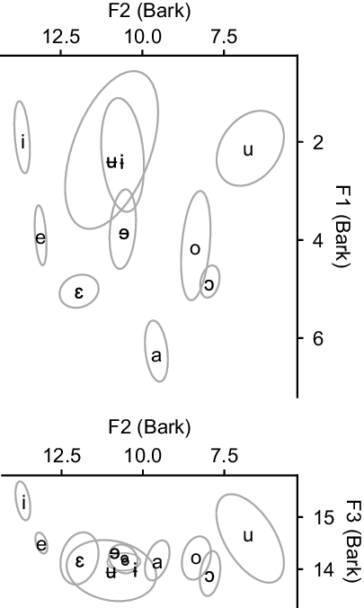
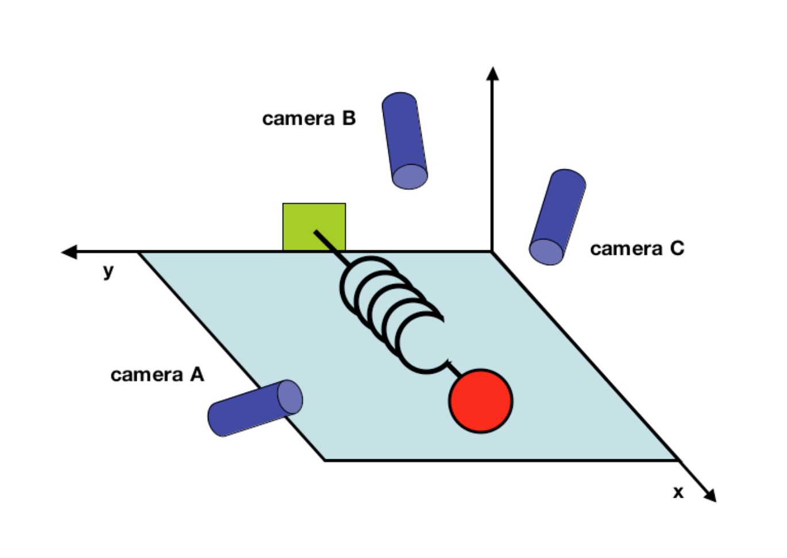
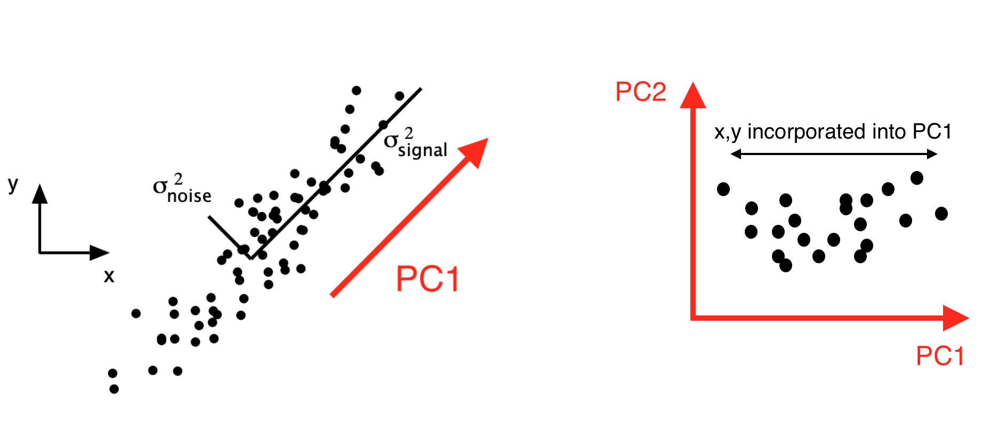

% Feature extraction and dimensionality reduction
% Matthew Faytak University at Buffalo NTU invited workshop
%   

## Overview

In the previous lecture, we discussed **feature selection**

* Manually *selecting* a subset of features see Liu (2011)

Here, we will discuss **feature extraction** 

* Especially using dimensionality reduction see Vlachos (2011)
* Taking a large number of features and using them to generate a smaller number of features
* Reduces the number of features required to describe a data set

## Outlook

Some different motivations underpin feature extraction: **data-driven** rather than theory-driven

* Allows new features well-suited to task to emerge from data
* Mainly concerned with *performance* of feature as an input to some task
* Especially frequent in **machine learning** and "artificial intelligence" applications

# Dimensionality reduction

## Features as dimensions

Features (observable attributes) define **dimensions** in a data set

* i.e. the lower formants define a 3-dimensional space (F1, F2, F3)
* 3D vowel space of Kejom: Faytak & Akumbu (2021)

## Curse of dimensionality 

If we have 1,000 features (dimensions) per observation, why not just use all of them? The **curse of dimensionality** 😈 

Adding *many* dimensions exponentially increases the amount of space that needs to be covered, with numerous undesirable side effects Bellman (1957); Keough & Mueen (2011)

* Computation becomes exponentially more difficult
* Exponentially more samples needed to evenly cover the space and maintain good performance

Distance in very high-dimensional spaces becomes nonsensical Aggarwal et al (2001)

* Objects become more or less equidistant from one another

## Dimensionality reduction

Converts a high dimensional space consisting of numerous features into a lower dimensional space consisting of fewer features Vlachos (2011)

Technically, feature selection is also a way of reducing dimensionality Liu (2011), Vlachos (2011)

* Feature selection is *theory-driven*: we know what the informative dimensions are

We are focusing today on **feature projection**

* Finding a smaller number of dimensions to express data in
* *Data-driven* approach: we don't know informative dimensions in advance; emerge from the data

## Benefits of dimensionality reduction

Avoids high dimensionality 😈, and also presents a useful complement to feature selection

* Especially well suited to exploratory analysis
* Or any other time when we don't have background knowledge to perform feature selection

## Example

Consider a ball on a spring from Shlens (2014) 

* Simple system - motion can be modeled as a sine wave-like time series along $x$ dimension
* If we don't know what $x$ is, though, we might place cameras at some arbitrary angles to try to find out

## Example

Measurement ends up being in terms of arbitrary dimensions which are *not the simplest, best way* to describe the system

* Six dimensions captured by our observations
* Movement in $x, y$ space filmed by cameras A, B, C Shlens (2014)  

# Principal component analysis

## Principal component analysis

Data often contains lots of **covariation**: measures are not totally independent; can vary systematically together

* Like $x$ and $y$ position in Camera A

**PCA** finds a new set of *orthogonal* dimensions which capture the most variance (and the least noise)

* The dimension shown below  describes variation better than $x$ or $y$ of Camera A alone
* Called *first principal component* or **PC1**

Shlens (2014)

## PCA in action

The previous slide showed PC1 for two-dimensional data; imagine PCA in many more dimensions, which is more typical

* PC-finding process can be repeated $n-1$ times where $n$ is the number of observations
* When repeated $r$ times, yields $r$ dimensions **PC1**, **PC2**, **PC3**, ... **PC$r$**
* The most informative dimensions are discovered first

## Rotation

New basis comes from **rotation** and rescaling of original data in high dimensions (see next slide)

PCs are a particular sort of **eigenvector**

* The latent dimensions discovered by PCA
* Form a better **basis** for describing the data

The amount of variance in the original data explained by each eigenvector is its **eigenvalue**

* Eigenvectors in PCA are rank-ordered according to their eigenvalues
* Most explanatory (highest eigenvalues) first

## Projection

The data can then be **projected** from the "naive" basis (the features originally measured) into a new basis

* Characterizing each observation on the newly discovered dimensions
* Often called PC "scores" because of the sense that we are grading each observation

Result: positions in new "PC space"

## The math

We've skipped over the linear algebra that underpins PCA, for now

* Understanding the concepts is sufficient
* We will return to a more mathematical definition later, when our data and our manipulations of it become more complicated

Some further reading on the linear algebra:

* Shlens (2014), a brief overview including the ball-on-spring example
* Jolliffe (2002), a reference book

Other reading:

* Nguyen & Holmes (2019), general tips

# Notebook time

## PCA in Python 

We now switch to our first Python notebook to demonstrate how to do PCA 👩‍💻🧑🏾‍💻👩🏻‍💻

* Opening a sample data set 
* Decomposition into eigenvectors
* Projection of data into new basis
* Basic data visualizations associated with PCA

Using acoustic data on phonation from Keating et al. (n.d.)

# Wrapping up

## Feature extraction: advantages

Extracted/projected features can speed analysis

* Or make it clear which features are useful to select

Improvements to research workflows

* Emerges *consistently* from given data set, and may improve replicability of analysis
* Very *fast* compared to selection of some features

## Feature extraction: advantages

Dimensionality reduction can aid data visualization, sometimes even making it more intuitive

* PC1 in the ball-on-spring example basically describes motion along the spring, where neither $x$ nor $y$ do
* Extremely useful at finding and capturing "ensembles" of features in higher-dimensional data
	* As in notebook: PCs capture covariation of groups of acoustic properties

## Feature extraction: disadvantages

Not *theory-driven*, which may pose liabilities

* Science is primarily theory-driven
* Engineering-type approach to non-engineering problems

New $n$-dimensional space may not be so easy to interpret: what does a dimension "mean"?

* Loadings may be difficult to interpret
* Dimensions discovered in linguistic data *don't have to* correspond to anything linguistically relevant

## Next time

Starting on the second major thread of these lectures: ultrasound as a method

* Basic principles
* Feature selection problems in ultrasound data
* More advanced methods covered in later lectures

## References {.bib}

Aggarwal, C., Hinneburg, A. & Keim, D. (2001). On the surprising behavior of distance metrics in high dimensional space. In <i>International Conference on Database Theory 2001</i>, 420-434. Springer. <a href="https://link.springer.com/chapter/10.1007/3-540-44503-X_27">PDF</a>

Bellman, R. (1957). <i>Dynamic Programming</i>. Princeton University Press.

Faytak, M. & Akumbu, P. (2021). Kejom (Babanki). <i>Journal of the International Phonetic Association</i>, 51(2), 333-354. <a href="https://doi.org/10.1017/S0025100319000264">DOI</a>

Jolliffe, I. (2002). Principal component analysis (2nd ed.). <i>Springer
series in statistics</i>. New York: Springer.

Keating, P., Kuang, J., Garellek, M., Esposito, C. & Khan, S. (n.d.) A cross-language acoustic space for phonation distinctions. Unpublished manuscript, UCLA. <a href="https://linguistics.ucla.edu/people/keating/Keating-etal_2019_ms.pdf">PDF</a> 

Keogh, E. & Mueen, A. (2011). Curse of dimensionality. In Sammut, C. & Webb, G. (eds.), <i>Encyclopedia of Machine Learning</i>, 257-258. Springer.

Liu, H. (2011). Feature selection. In Sammut, C. & Webb, G. (eds.), <i>Encyclopedia of Machine Learning</i>, 402-406. Springer.

Nguyen, L. & Holmes, S. (2019). Ten quick tips for effective dimensionality reduction. <i>PLoS Computational Biology</i>, 15(6), e1006907. <a href="https://doi.org/10.1371/journal.pcbi.1006907">DOI</a>

Shlens, J. (2014). A Tutorial on Principal Component Analysis. <a href="https://arxiv.org/abs/1404.1100">arXiv</a>

Vlachos, M. (2011). Dimensionality reduction. In Sammut, C. & Webb, G. (eds.), <i>Encyclopedia of Machine Learning</i>, 402-406. Springer.

Zhang, X. (2011). Covariance matrix. In In Sammut, C. & Webb, G. (eds.), <i>Encyclopedia of Machine Learning</i>, 235-238. Springer.
