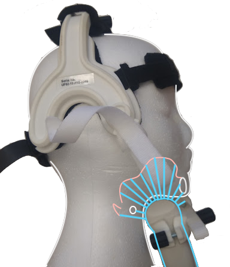
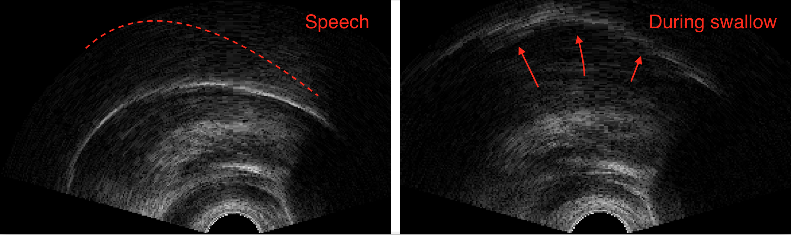
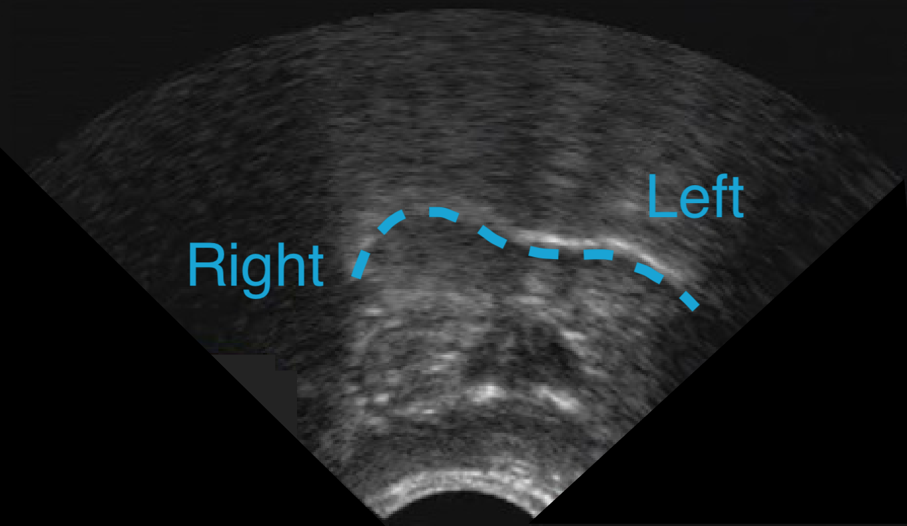
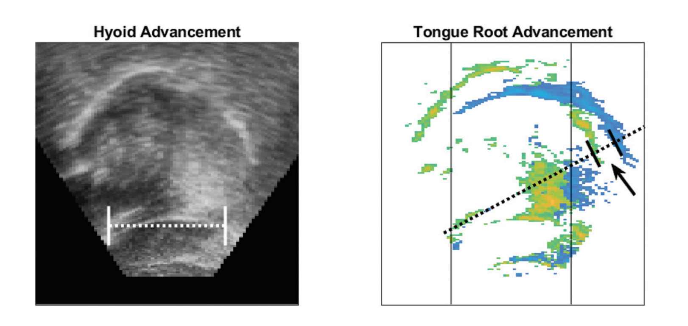

% NTU lectures (3)
% Matthew Faytak University at Buffalo
%   

## In this lecture

Ultrasound as a means of collecting information on tongue position

* Basic data collection routines
* Advantages and drawbacks

Common features extracted from data

* Contour tracing
* Registration lines

# Ultrasound basics

## Principles of the method

Low intensity, very high frequency sound is transmitted through soft tissue (pictured: blue) and reflects back when the density of the medium changes

* Tissue-tissue boundaries, such as tendons in muscle
* Tissue-air boundaries, such as the surface of the tongue (pictured: pink)

## Stabilization

Frame of reference must be fixed during recording to compare tongue positions; if it is not, motion of probe must be corrected e.g. Whalen et al (2004); Mielke et al (2005)

* Most often fixed using a headset which holds the probe under the chin
* Pictured: Articulate Instruments UltraFit Spreafico et al. (2018) 

## Resulting images

Video slowed down by four times; anterior is to the right

* Lingual articulations highlighted in red

<video class="tab" controls width=600>
	<source src="./assets/media/Oysters-labels.mp4">
</video>

## Resulting images

Reflection signal from tongue surface shows up as a bright *contour*; useful part is between two "shadows"

* Hyoid bone shadow in the back
* Chin or mandible shadow in the front
* Bone absorbs energy rather than reflecting it back 

Due to chin shadow, tongue tip is usually not visible in ultrasound data

## Rigid landmarks

Often collected prior to recording

**Palate trace**, by doing a *swallow task*: swallow water and watch as tongue suctions to roof of mouth

* Provides position of the hard palate
* Useful for gauging constriction degree

## Rigid landmarks 

**Bite plane**, by having the speaker bite down on a rigid plate and press tongue up into it Scobbie et al (2011)

* Provides common angle for representation of data from multiple speakers
* Wide tongue depressor held between teeth is suitable

## Other imaging types

While it's not our focus, ultrasound can be taken in non-sagittal planes

* **Coronal slice** can be imaged by rotating the probe under the chin 90°
* Useful for examining lateralization, grooving Mielke et al (2011); Whalen et al (2011)

Image modified from Mielke et al (2011)

## Laryngeal ultrasound

Also not our focus, but possible

* Imaging in an **oblique** slice (not sagittal or coronal) Moisik et al (2014)
* Images the cartilaginous structures of the larynx

image from Moisik et al (2014)

# Use cases

## Uses of ultrasound

Generally used for imaging posture or shape of the tongue from root to blade, and change over time

* Dorsal articulations Evans et al (2016); Howson & Kochetov (2020); Shaw et al (2021)
* Pharyngeal and tongue root articulations Gick et al (2006); Allen et al (2013); Hudu (2014); Kirkham & Nance (2017); Chiu & Sun (2020)
* Complex tongue shapes (laterals, rhotics, clicks) Mielke et al (2011); Lee-Kim et al (2014); Miller (2016); Tabain & Beare (2018); Hussain & Mielke (2021)

A critical tool for imaging vocal tract configurations in the field, outside of the lab Gick (2002)

* Non-invasive, generally not intimidating
* By far, the most portable vocal track imaging technology

## Drawbacks

Only images *the tongue*; no simultaneous imaging of hard palate possible; no imaging of larynx or velum

Image can be noisy, and not every potential participant images well

* Small, young people image the best
* Beards can get in the way
* Probe can press on larynx external cartilages (Adam's apple), causing pain

## Data type

Perhaps the biggest drawback is the data itself: raw reflectivity information; requires extensive post-processing

**Feature extraction**: complex image processing, often requires manual intervention

* Contours following the reflection at the tongue surface 
* Motion of contours along registration lines

Next lecture: **feature projection** methods

# Ultrasound feature extraction

## Contour extraction

By far the most commonly extracted feature for ultrasound data Iskarous (2005); Stone (2005)

* We know that reflection represents the surface of the tongue; tells us about vocal tract function
* Actual tongue surface is represented by *bottom edge* of bright line

## Semi-automated extraction

All current contour extraction methods are at least partly automated Roon et al (2021)

* Most require an initial "seed" contour to be placed manually
* Manual contour location is optimized
* Optimized contour is tracked from frame to frame

Some additional manual intervention required: frame-to-frame tracking drifts away from ground truth

## Latest versions

Contour extraction has improved substantially in recent years; often close to manually drawn contours Roon et al (2021)

* SLURP Laporte & Ménard (2018); Laporte (2018)
* GetContours, which also has a SLURP implementation Tiede (2021)
* EdgeTrak Li et al (2005)
* Newest versions of Articulate Assistant Advanced tracker

## Contour modeling

Several options for further processing of contours

Most common: model contour location and overlap using:

* Smoothing-spline ANOVA (SSANOVA) Davidson (2006); Gu (2014); pictured below
* Increasingly, generalized additive mixed models (GAMMs) Strycharczuk & Sebregts (2018); Matsui & Kochetov (2018); Coretta (2019, 2020); Heyne et al (2019)

figure from Weller et al. (to appear)

## Contour shape analysis 

The shape and curvature parameters of contours can also be measured

* How convex/concave contours are Zharkova et al (2015); Dawson et al (2016)
* How complex the contour's shape is Dawson et al (2016)

Importantly, these methods work even when the probe is not stabilized

## Registration lines

Motion of *certain parts* of contours can be subjected to further feature extraction by drawing **registration lines** and tracking movement along those lines Gick et al (2006); Pouplier (2008); many others

* Lines drawn in a fan shaped grid out from *probe origin* (at bottom middle of image)
* Sometimes, genioglossus tendon is used as origin instead see figure below, from Lulich & Cavar (2019)
	* Attaches muscles of tongue to back side of chin; clearly visible in ultrasound

* Common in studies of single lingual gestures, i.e. tongue root advancement or retraction Percival et al. (2018); Lulich & Ćavar (2019)

## Dimensionality reduction on contours

Dimensionality reduction methods such as PCA can also be applied to reveal *variation in contour position* Turton (2015); Bennett et al (2018); Strycharczuk et al (2021)

* Feature input to PCA is $x,y$ coordinates of $n$ points along contours
* PC1 and PC2 typically capture most of the variance
* Below: mean contour in black; negative and positive scores indicated with dashed lines from Bennett et al (2018)

# Wrapping up

## Advantages of ultrasound

Lightweight method, relatively user-friendly

* Most portable
* Least invasive
* Least expensive
* Often somewhat familiar to participants

Because of these factors it has few competitors for fieldwork

## Disadvantages of ultrasound

The data format:

* **High-dimensional** and often noisy
* Requires processing

The usual feature extraction methods:

* Contour extraction is time-consuming, but contours are regarded as the standard feature to extract
* On a practical level, requires a small army of annotators
* Inter-annotator agreement can be a concern

## Next lecture: more features

Various ways around the contour problem: other features to extract

Going in the direction of **feature engineering**

* Using entire image to produce new features
* Key insight: the image's pixels are *each* a feature, so  ultrasound data sets are really huge sets of pixel-level measurements

## References {.bib}

Allen, B., Pulleyblank, D., & Ajíbóyè, Ọ. (2013). Articulatory mapping of Yorúbà vowels: an ultrasound study. *Phonology*, 30(2), 183-210. <a href="https://doi.org/10.1017/S0952675713000110">DOI</a>

Bennett, R., Chiosáin, M., Padgett, J., & McGuire, G. (2018). An ultrasound study of Connemara Irish palatalization and velarization. *Journal of the International Phonetic Association*, 48(3), 261-304. <a href="https://doi.org/10.1017/S0025100317000494">DOI</a>

Chiu, C., & Sun, J. (2020). On pharyngealized vowels in Northern Horpa: An acoustic and ultrasound study. *The Journal of the Acoustical Society of America*, 147(4), 2928–2946. <a href="https://doi.org/10.1121/10.0001005">DOI</a>

Coretta, S. (2020). Longer vowel duration correlates with greater tongue root advancement at vowel offset: Acoustic and articulatory data from Italian and Polish. *The Journal of the Acoustical Society of America*, 147(1), 245-259. <a href="https://doi.org/10.1121/10.0000556">DOI</a>

Coretta, S. (2019). Assessing mid-sagittal tongue contours in polar coordinates using generalised additive (mixed) models.
OSF Preprint. <a href="https://doi.org/10.31219/osf.io/q6vzb">DOI</a>

Davidson, L. (2006). Comparing tongue shapes from ultrasound imaging using
smoothing spline analysis of variance. *The Journal of the Acoustical Society of
America*, 120, pp. 407–415. <a href="https://doi.org/10.1121/1.2205133">DOI</a>

Dawson, K., Tiede, M. & Whalen, D. (2016). Methods for quantifying tongue shape and complexity using ultrasound imaging. *Clinical Linguistics & Phonetics*, 30(3-5), 328-344. <a href="https://doi.org/10.3109/02699206.2015.1099164">DOI</a>

Evans, J., Sun, J., Chiu, C. & Liou, M. (2016). Uvular approximation as an articulatory vowel feature. *Journal of the International Phonetic Association*, 46(1), 1–31. <a href="https://doi.org/10.1017/S0025100315000146">DOI</a>

Gick, B. (2002). The use of ultrasound for linguistic phonetic fieldwork. *Journal of the International Phonetic Association*,
32(2), 113–121. <a href="https://doi.org/10.1017/S0025100302001007">DOI</a>

Gick, B., Pulleyblank, D., Campbell, F., & Mutaka, N. (2006). Low vowels and transparency in Kinande vowel harmony. *Phonology*, 23(1), 1–20. <a href="https://doi.org/10.1017/S0952675706000741">DOI</a>

Gick, B., Campbell, F., Oh, S. & Tamburri-Watt, L. (2006). Toward universals in the gestural organization of syllables: A cross-linguistic study of liquids. *Journal of Phonetics*, 34(1), 49-72. <a href="https://doi.org/10.1016/j.wocn.2005.03.005">DOI</a>

Gu, C. (2014). Smoothing spline ANOVA models: R package gss. Journal of Statistical Software, 58, 1-25. <a href="https://doi.org/10.18637/jss.v058.i05">DOI</a>

Heyne, M., Derrick, D., & Al-Tamimi, J. (2019). Native language influence on brass instrument performance: An application of generalized additive mixed models (GAMMs) to midsagittal ultrasound images of the tongue. *Frontiers in Psychology*, 2597. <a href="https://doi.org/10.3389/fpsyg.2019.02597">DOI</a> 

Howson, P. & Kochetov, A. (2020). Lowered F2 observed in uvular rhotics involves a tongue root gesture: Evidence
from Upper Sorbian. *The Journal of the Acoustical Society of America*, 147(4), 2845–2857. <a href="https://doi.org/10.1121/10.0000997">DOI</a>

Hudu, F. (2014). [ATR] feature involves a distinct tongue root articulation: Evidence from ultrasound imaging. *Lingua*, 143, 36–51. <a href="https://doi.org/10.1016/j.lingua.2013.12.009">DOI</a>

Hussain, Q. & Mielke, J. (2021). An acoustic and articulatory study of rhotic and rhotic-nasal vowels of Kalasha. *Journal of Phonetics*, 87, 101028. <a href="https://doi.org/10.1016/j.wocn.2020.101028">DOI</a>

Iskarous, K. (2005). Detecting the edge of the tongue: A tutorial. *Clinical Linguistics & Phonetics*, 19(6-7), 555-565. <a href="https://doi.org/10.1080/02699200500113871">DOI</a>

Kirkham, S., & Nance, C. (2017). An acoustic-articulatory study of bilingual vowel production: Advanced tongue root vowels in Twi and tense/lax vowels in Ghanaian English. *Journal of Phonetics*, 62, 65–81. <a href="https://doi.org/10.1016/j.wocn.2017.03.004">DOI</a>

Laporte, C. (2018). Speech and Language Ultrasound Research Package (SLURP). <a href="https://github.com/cathylaporte/SLURP">GitHub</a>

Laporte, C. & Ménard, L. (2018). Multi-hypothesis tracking of the tongue surface in ultrasound video recordings of normal and impaired speech. *Medical Image Analysis*, 44, 98-114. <a href="https://doi.org/10.1016/j.media.2017.12.003">DOI</a>

Lee-Kim, S., Kawahara, S., & Lee, S. (2014). The 'whistled' fricative in xiTsonga: Its articulation and acoustics. *Phonetica*, 71(1), 50–81. <a href="https://doi.org/10.1159/000362672">DOI</a>

Li, M., Kambhamettu, C. & Stone, M. (2005). Automatic contour tracking in
ultrasound images. *Clinical Linguistics & Phonetics*, 19(6-7), 545–554. <a href="https://doi.org/10.1080/02699200500113616">DOI</a>

Lulich, S. & Ćavar, M. (2019). Phonetics of Polish "soft"-"hard" vowel allophony. *The Journal of the Acoustical Society of America*, 146(4), 2263-2278. <a href="https://doi.org/10.1121/1.5127834">DOI</a>

Matsui, M. & Kochetov, A. (2018). Tongue root positioning for voicing vs. contrastive palatalization:
An ultrasound study of Russian word-initial coronal stops [有声性対立のための舌根調音と硬口蓋化子音対立の関係―ロシア語語頭舌頂閉鎖音の超音波画像解析―]. *音声研究*, 22(2), 81-94. <a href="https://doi.org/10.24467/onseikenkyu.22.2_81">DOI</a>

Mielke, J., Olson, K., Baker, A. & Archangeli, D. (2011). Articulation of the Kagayanen interdental approximant: An ultrasound study. *Journal of Phonetics*, 39(3), 403-412. <a href="https://doi.org/10.1016/j.wocn.2011.02.008">DOI</a>

Mielke, J., Baker, A., Archangeli, D., & Racy, S. (2005). Palatron: a technique for aligning ultrasound images of the tongue and palate. *Coyote Papers*, 14, 96-107. <a href="http://hdl.handle.net/10150/126629">PDF</a>

Miller, A. (2016). Posterior lingual gestures and tongue shape in Mangetti Dune !Xung clicks. *Journal of Phonetics*, 55, 119–148. <a href="https://doi.org/10.1016/j.wocn.2015.12.001">DOI</a>

Moisik, S., Lin, H., & Esling, J. (2014). A study of laryngeal gestures in Mandarin citation tones using simultaneous laryngoscopy and laryngeal ultrasound (SLLUS). *Journal of the International Phonetic Association*, 44(1), 21-58. <a href="https://doi.org/10.1017/S0025100313000327">DOI</a>

Percival, M., Kochetov, A. & Kang, Y. (2018). An ultrasound study of gemination in coronal stops in Eastern Oromo. In *Proceedings of Interspeech 2018*, 1531-1535. <a href="https://doi.org/10.21437/Interspeech.2018-2512">DOI</a>

Pouplier, M. (2008). The role of a coda consonant as error trigger in repetition tasks. *Journal of Phonetics*, 36(1), 114-140. <a href="https://doi.org/10.1016/j.wocn.2007.01.002">DOI</a>

Roon, K., Chen, W., Iwasaki, R., Kang, J., Kim, B., Shejaeya, G., Tiede, M. & Whalen, D. (2021). Comparison of auto-contouring and hand-contouring of ultrasound images of the tongue surface. Clinical Linguistics & Phonetics, 1-20. <a href="
https://doi.org/10.1080/02699206.2021.1998633">DOI</a>

Scobbie, J., Lawson, E., Cowen, S., Cleland, J. & Wrench, A. (2011). A common co-ordinate system for mid-sagittal articulatory measurement. *QMU CASL Working Papers*, 20. <a href="https://eresearch.qmu.ac.uk/bitstream/handle/20.500.12289/3597/eResearch%25203597.pdf">PDF</a> 

Shaw, J., Carignan, C., Agostini, T., Mailhammer, R., Harvey, M., & Derrick, D. (2020). Phonological contrast and phonetic variation: The case of velars in Iwaidja. *Language*, 96(3), 578–617. <a href="https://muse.jhu.edu/article/764692">PDF</a>

Spreafico, L., Pucher, M. & Matosova, A. (2018). UltraFit: A speaker-friendly headset for ultrasound recordings in speech science. In *Proceedings of Interspeech 2018*, 1517-1520. <a href="https://www.isca-speech.org/archive_v0/Interspeech_2018/pdfs/0995.pdf">PDF</a>

Stone, M. (2005). A guide to analysing tongue motion from ultrasound images. *Clinical Linguistics & Phonetics*, 19(6-7), 455-501. <a href="https://doi.org/10.1080/02699200500113558">DOI</a>

Strycharczuk, P., Ćavar, M., & Coretta, S. (2021). Distance vs time. Acoustic and articulatory consequences of reduced vowel duration in Polish. *The Journal of the Acoustical Society of America*, 150(1), 592-607. <a href="https://doi.org/10.1121/10.0005585">DOI</a>

Strycharczuk, P. & Sebregts, K. (2018). Articulatory dynamics of (de)gemination in Dutch. *Journal of Phonetics*, 68, 138-149. <a href="https://doi.org/10.1016/j.wocn.2018.03.005">DOI</a>

Tabain, M., & Beare, R. (2018). An ultrasound study of coronal places of articulation in Central Arrernte: Apicals, laminals and rhotics. *Journal of Phonetics*, 66, 63–81. <a href="https://doi.org/10.1016/j.wocn.2017.09.006">DOI</a>

Tiede, M. (2021). GetContours [v3.5]. <a href="https://github.com/mktiede/GetContours">GitHub</a>

Turton, D. (2015). Determining categoricity in English /l/-darkening: A principal component analysis of ultrasound spline data. In *Proceedings of ICPhS 18*. <a href="https://www.internationalphoneticassociation.org/icphs-proceedings/ICPhS2015/Papers/ICPHS0810.pdf">PDF</a>

Weller, J., Faytak, M., Steffman, J., Mayer, C., Teixeira, G. & Tankou, R. (to appear). Supralaryngeal articulation across voicing and aspiration in Yemba vowels. In *Proceedings of ACAL 51/52*. 

Whalen, D., Iskarous, K., Tiede, M.,  Ostry, D., Lehnert-LeHouillier, H., Vatikiotis-Bateson, E. & Hailey, D. (2004). The Haskins optically‐corrected ultrasound system (HOCUS). *Journal of Speech, Language, and Hearing Research*, 48, 543-553. <a href="https://doi.org/10.1044/1092-4388(2005/037)">DOI</a>

Whalen, D., Shaw, P., Noiray, A. & Antony, R. (2011). Analogs of Tahltan consonant harmony in English CVC syllables. In *Proceedings of ICPhS 17*, 2129-2132. <a href="https://hal.archives-ouvertes.fr/hal-03476262/document">PDF</a>

Zharkova, N., Gibbon, F. & Hardcastle, W. (2015). Quantifying lingual coarticulation using ultrasound imaging data collected with and without head stabilisation. *Clinical Linguistics & Phonetics*, 29(4), 249-265. <a href="https://doi.org/10.3109/02699206.2015.1007528">DOI</a>
