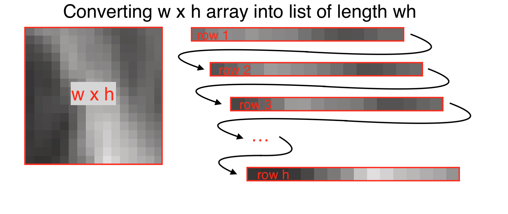

% NTU lectures (4)
% Matthew Faytak University at Buffalo
%   

## Refresher: contour extraction

Contours can be extracted from the ultrasound image using a combination of human-generated hints and automatic processing Iskarous (2005); Stone (2005)

## Refresher: ultrasound data analysis

Usually done on **contours** with a spline model which can handle non-linear patterns (like tongue shapes) Davidson (2006); Heyne et al (2019)

* SSANOVA (smoothing spline ANOVA), pictured below
* GAMMs
* Both quite computationally intensive

figure from Weller et al. (to appear)

## Overview: this lecture

Various types of **feature engineering**

* Generating new features from existing ones
* Often through recombination, averaging, etc.

All get around  feature extraction and the need for (most) human intervention

* Pixel difference methods
* Optical flow
* Dimensionality reduction on ultrasound frames
	* Our focus here and in our final notebook

# Pixel-based motion detection

## Pixels

Each ultrasound image is composed of tens of thousands of pixels, each of which has a numerical value indicating brightness

* Directly relates to position of tongue: brightness means reflectivity

## Pixel shape

The pixels are *arc-shaped* in most ultrasound frames because the raw reflection data is stored as a rectangular grid Wrench & Scobbie (2008); Eshky et al (2021)

* Column = **scan line** (the energy/reflection of one element in probe)
* Row = distance from probe
* Color = reflectivity

This grid is transformed to real-world proportions before we work with it figure from Eshky et al (2021)

## Pixel difference (PD)

Tongue position *change* means pixels change in brightness from frame to frame

* Some pixels gain brightness as tongue moves into their region
* Others lose brightness as tongue moves away

The **Euclidean distance** of two frames in terms of all their pixels can be used as a measure of tongue movement figure from Palo (2019)

## Definition

Defining PD more precisely Palo (2019):

* Each frame $F$ is an $n_x \times n_y$ dimensional vector, where $n_x$ is scanlines and $n_y$ is pixels per scanline

* For $k = \{F_1, F_2, \ldots F_{n-1}\}$

## Step size

We can calculate the difference over successive frames (step size 1), or over frames more separated in time (step size $L$)

* for $k = \{F_1, F_2, \ldots F_{n-L}\}$

* The time associated with this measurement is the average of the time of the two involved frames, or $1/2(t_{F_k} + t_{F_{k+L}})$

Palo (2019) mainly uses a step size of 1

* Though depending on the articulation at issue, larger step sizes may be appropriate

## Applications of PD

Movement detected includes *intrinsic tongue muscles*, unlike other measures discussed so far

* Measures more than just movement in the surface contour
* Can even detect a speaker's heart rate (pulse in vessels in the tongue)

Various psycholinguistic applications McMillan &
Corley (2010); Palo (2019)

* Useful for detection of pre-speech articulation which may not be represented in the acoustic signal
* Refinement of reaction times based on production

## Optical flow (OF)

Related but more computationally complex: **optical flow**, which detects apparent motion between two frames Horn & Schunck (1981)

* Like PD, detects  magnitude of motion; unlike PD, gives *direction* of motion as well
* Produces a **flow field** for smaller elements in image, which can be averaged to a **consensus** figure from Faytak, Moisik, & Palo (2021)

## Applications of OF

Integrating the velocity signal  gives amount of displacement for rigid bodies (i.e. the larynx)  Moisik et al (2014); figure from Faytak, Moisik & Palo (2021)

# Pixel dimensionality reduction

## Pixel dimensionality reduction

Dimensionality reduction carried out not on ultrasound contours, but on entire **ultrasound frames**

* Ultrasound frames are made up of tens of thousands of individual pixels
* Each with a value indicating brightness (e.g. 0=black, 255=white)

Brightness values can be used as raw data for dimensionality reduction

## Pixels and scan lines

Each ultrasound frame can be thought of as a matrix of width $w$ by height $h$

* $w,h$ values must be fixed throughout data collection (images must be same size)
* Each column of pixels of shape $1 \times h$ represents a single **scan line** from the probe
* Each scan line is reflectivity data from a single element in the probe

## High dimensionality

Each pixel at location $x,y$ across data sets with the same frame size $w \times h$ can be thought of as a separate feature

* Meaning: each frame contains thousands, or tens of thousands, of features

Challenge for **feature selection**: 

* Bad idea to use every single pixel (curse of dimensionality)
* Not easy to pick a small number of pixels which are good predictors of the phenomenon we're studying
* Solution: **engineer new features** which capture the variation

## Recap: dimensionality reduction

PCA outputs **eigenvectors** and **eigenvalues**

* Eigenvectors (PCs) are patterns of variation uncovered in the data
* Eigenvalues assign importance to explaining variation in the data
* Observations can be transformed from naive basis into "PC space"

We might recall this was applied to numerous acoustic measures in our first notebook

Eigenvector loadings:

Data in PC space:

## Calculating image eigenvectors

Method can be extended to *image data*: pixels in an image of shape $w \times h$ are treated as a *very long list* of features of length $wh$

* Basically, rows or columns are "unstacked" and "put end to end" to form a list 

Like in the notebook's dataframe:

* Each row in the dataframe is an observation (i.e. an ultrasound frame)
* Each column in the dataframe is a feature (pixel in a given location)
* The difference: *many more* columns/features

## Math

Here, or later?

## Eigenvectors as eigenimages

Eigenvectors which result from PCA on this data reflect *variation in pixel brightness over physical space*; we can convert our length *wh* eigenvectors back to 

* Here's what our eigenvectors looked like in NB:
* Here's what image eigenvectors look like, if transformed back to image shape

## Slide

* Faces (eigenfaces) Turk & Pentland (1991)
* Lips (eigenlips) Bregler & Konig (1994)

image from T&P

## Eigentongues

Hueber et al (2007) coined **eigentongues**, from eigenfaces

Each PC used to visualize the data can be understood by the patterns of covariation shown among pixels in its eigentongue

show example

* shows patterns of negative and positive covariation in pixel brightness across a data set
* correspond to positions of the visible tongue contour
	* as well as any other patterning in the image (hyoid shadow position, internal musculature of tongue, etc.)
	* captures more information than tongue contour position in this way

## eigentongues

White = positive covariation with PC score; black = negative covariation with PC score

* Higher PC1 score makes brighter pixels light up
* Lower PC1 score makes darker pixels light up

[image: hueber-eigen]

## PC scores

We can then characterize the ultrasound image data set in PC-space terms (PC scores)

show ex

* Hoole & Pouplier as an example of direct analysis of PC1
* regression analysis
* correlation analysis

## Time series of PC scores

If the data include all frames in a target interval, then the PCs can be used to track dynamical changes across the duration of the target interval

* Mielke & Carignan
* Kochetov, Faytak, Nara

## Reconstruction using eigenvectors

Reconstruction of basis data from linear combination and weighting of eigentongues is easily achieved

Reconstruction in Faytak et al. 2020

## Reconstruction and missing data

Works particularly nicely when part of an observation's data is missing, but similar complete data was used to generate the eigenvectors

Masked test data and its reconstruction: figures from Turk & Pentland (1991)

 

Ground truth (which was used in training set for eigenvectors):

## Caveats

Eigenimage analysis can work with new data only if images are (more or less) contained within training set

* Turk & Pentland eigenface data set is mostly white, entirely men
* ...

# Wrapping up

## A summary slide

Analysis of entire ultrasound images 

* Using dimensionality reduction (PCA) over all pixels
* Measuring change in pixel intensity
* Measuring optical flow

## Pros

Very efficient once the basics are mastered

* Speedy (big advantage over basic contour extraction)
* Very replicable

Potentially more informative in some respects than contours

* Especially for data where parts of tongue contour aren't visible

## Convergence with other methods

converging on common analysis across methods: pixel and pixel dimred methods easy to use on other data types

* MRI Oh & Lee (2018)
* Video of face, especially lips Krause et al (2020)

## Cons

Best suited to analyses of relative similarity and difference of sounds 

* Somewhat limited
* Fairly different from some approaches to analysis ("engineering-y")

If using a train-test approach, hinges on quality of training data

* While there are only so many poses the tongue can take, 

## References

Bregler, C. & Konig, Y. (1994). "Eigenlips" for robust speech recognition. In *Proceedings of ICASSP '94 Vol. 2*. <a href="https://doi.org/10.1109/ICASSP.1994.389567">DOI</a>

Danilouchkine, M., Mastik, F. & van der Steen, A. (2009). A study of
coronary artery rotational motion with dense scale-space optical
flow in intravascular ultrasound. *Physics in Medicine and Biology*,
54(6), 1397–1418. <a href="https://doi.org/10.1088/0031-9155/54/6/002">DOI</a>

Davidson, L. (2006). Comparing tongue shapes from ultrasound imaging using
smoothing spline analysis of variance. *The Journal of the Acoustical Society of
America*, 120, pp. 407–415. <a href="https://doi.org/10.1121/1.2205133">DOI</a>

Eshky, A., Cleland, J., Ribeiro, M., Sugden, E., Richmond, K. & Renals, S. (2021). Automatic audiovisual synchronisation for ultrasound tongue imaging. *Speech Communication*, 132, 83-95. <a href="https://doi.org/10.1016/j.specom.2021.05.008">DOI</a>

Faytak, M., Moisik, S. & Palo, P. (2021). The Speech Articulation Toolkit (SATKit): Ultrasound image analysis in Python. In *Proceedings of ISSP 12*, 234-237. <a href="https://issp2020.yale.edu/ProcISSP2020.pdf">PDF</a> 

Heyne, M., Derrick, D., & Al-Tamimi, J. (2019). Native language influence on brass instrument performance: An application of generalized additive mixed models (GAMMs) to midsagittal ultrasound images of the tongue. *Frontiers in Psychology*, 2597. <a href="https://doi.org/10.3389/fpsyg.2019.02597">DOI</a>

Horn, B., & Schunck, B. (1981). Determining optical flow. *Artificial
Intelligence*, 17(1), 185–203. <a href="https://doi.org/10.1016/0004-3702(81)90024-2">DOI</a>

Hueber, T., Aversano, G., Chollet, G., Denby, B., Dreyfus, G., Oussar, Y., Roussel, P. & Stone, M. (2007). Eigentongue feature extraction for an ultrasound-based silent speech interface. In *Proceedings of ICASSP '07 Vol. 1*.
<a href="https://doi.org/10.1109/ICASSP.2007.366140">DOI</a>

Iskarous, K. (2005). Detecting the edge of the tongue: A tutorial. *Clinical Linguistics & Phonetics*, 19(6-7), 555-565. <a href="https://doi.org/10.1080/02699200500113871">DOI</a>

Krause, P., Kay, C. & Kawamoto, A., (2020) Automatic motion tracking of lips using digital video and OpenFace 2.0, *Laboratory Phonology* 11(1), 9. <a href="https://doi.org/10.5334/labphon.232">DOI</a>

McMillan, C. & Corley, M. (2010). Cascading influences on the
production of speech: Evidence from articulation. *Cognition*,
117(3), 243–260. <a href="https://doi.org/10.1016/j.cognition.2010.08.019">DOI</a>

Moisik, S., Lin, H., & Esling, J. (2014). A study of laryngeal
gestures in Mandarin citation tones using simultaneous
laryngoscopy and laryngeal ultrasound (SLLUS). *JIPA*, 44(1), 21–
58. <a href="https://doi.org/10.1017/S0025100313000327">DOI</a>

Oh, M., & Lee, Y. (2018). ACT: An Automatic Centroid Tracking tool for analyzing vocal tract actions in real-time magnetic resonance imaging speech production data. *The Journal of the Acoustical Society of America*, 144(4), EL290-EL296. <a href="https://doi.org/10.1121/1.5057367">DOI</a>

Palo, P. (2019). Measuring pre-speech articulation. Doctoral dissertation, Queen Margaret University. <a href="https://eresearch.qmu.ac.uk/handle/20.500.12289/10163">PDF</a>

Stone, M. (2005). A guide to analysing tongue motion from ultrasound images. *Clinical Linguistics & Phonetics*, 19(6-7), 455-501. <a href="https://doi.org/10.1080/02699200500113558">DOI</a>

Turk, M. & Pentland, A. (1991).  Eigenfaces for recognition. *Journal of Cognitive Neuroscience*, 3(1), 71-86. <a href="https://doi.org/10.1162/jocn.1991.3.1.71">DOI</a>

Weller, J., Faytak, M., Steffman, J., Mayer, C., Teixeira, G. & Tankou, R. (to appear). Supralaryngeal articulation across voicing and aspiration in Yemba vowels. In *Proceedings of ACAL 51/52*. 

Wrench, A., & Scobbie, J. (2008). High-speed cineloop ultrasound vs. video ultrasound tongue imaging: Comparison of front and back lingual gesture location and relative timing. In *Proceedings of ISSP 8*. <a href="https://eresearch.qmu.ac.uk/handle/20.500.12289/2012">PDF</a>
