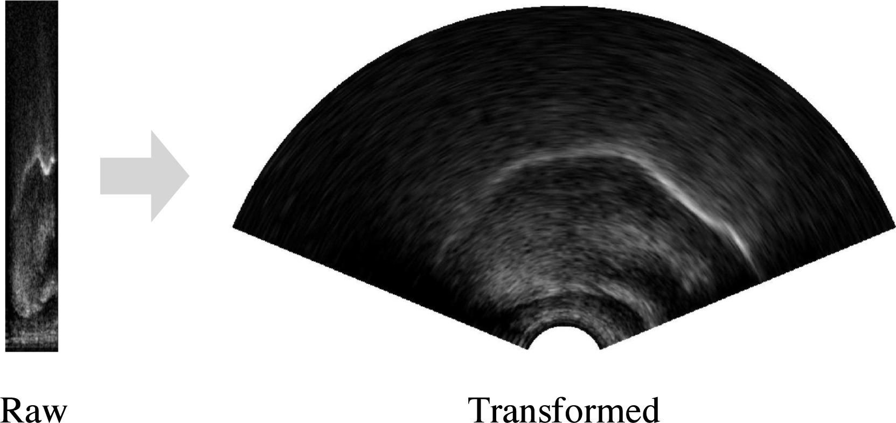

% NTU lectures (4)
% Matthew Faytak University at Buffalo
%   

## Refresher: contour extraction

Contours can be extracted from the ultrasound image using a combination of human-generated hints and automatic processing Iskarous (2005); Stone (2005)

## Refresher: ultrasound data analysis

Usually done on **contours** with a spline model which can handle non-linear patterns (like tongue shapes) Davidson (2006); Heyne et al (2019)

* SSANOVA (smoothing spline ANOVA), pictured below
* GAMMs
* Both quite computationally intensive

figure from Weller et al. (to appear)

## Overview: this lecture

Various types of **feature engineering**

* Generating new features from existing ones
* Often through recombination, averaging, etc.

All get around  feature extraction and the need for (most) human intervention

* Pixel difference methods
* Optical flow
* Dimensionality reduction on ultrasound frames
	* Our focus here and in our final notebook

# Pixel difference

## Pixels

Each ultrasound image is composed of tens of thousands of pixels, each of which has a numerical value indicating brightness

* Directly relates to position of tongue: brightness means reflectivity

## Pixel shape

The pixels are *arc-shaped* in most ultrasound frames because the raw reflection data is stored as a rectangular grid Wrench & Scobbie (2008); Eshky et al (2021)

* Column = **scan line** (the energy/reflection of one element in probe)
* Row = distance from probe
* Color = reflectivity

This grid is transformed to real-world proportions before we work with it figure from Eshky et al (2021)

## Pixel difference

Tongue position *change* means pixels change in brightness from frame to frame

* Some pixels gain brightness as tongue moves into their region
* Others lose brightness as tongue moves away

The **Euclidean distance** of two frames  in terms of all their pixels can be used as a measure of tongue movement Palo (2019)

image from Palo or from the SATKIT paper

## Defining

Defining this more precisely:

* Each frame $F$ is an $n_x \times n_y$ dimensional vector, where $n_x$ is scanlines and $n_y$ is pixels per scanline

for $k = \{F_1, F_2, \ldots F_{n-1}\}$

## Step size

We can calculate the difference over successive frames (step size 1), or over frames more separated in time (step size $L$)

for $k = \{F_1, F_2, \ldots F_{n-L}\}$

The time associated with this measurement is the average of the time of the two involved frames, or $1/2(t_{F_k} + t_{F_{k+L}})$

## Applications of pixel difference method

Detection of motion includes intrinsic tongue muscles, unlike other measures discussed so far; useful for detection of pre-speech articulation

* various psycholinguistic applications (refinement of production based reaction time)

# Optical flow

## Optical flow

Related to pixel difference, but more computationally complex, is optical flow

* detects apparent motion evidenced by two images
* like basic pixel difference, returns the magnitude of the motion
* unlike pixel difference, yields direction of motion in addition to magnitude
* actual physical movement of rigid bodies can be calculated through further feature engineering

images (2x slides?)

# dimensionality reduction on ultrasound frames

## our focus today

Dimensionality reduction carried out not on ultrasound contours, but on ultrasound frames

## pixel structure

Recall that ultrasound frames are made up of tens of thousands of individual pixels

* each with their own value from 0 to 255, indicating brightness (black to white)

## Scan lines

Going into more detail, each ultrasound image can be thought of as a matrix of width w by height h

* w, h values must be fixed throughout data collection (images don't change in size)
* each column of pixels of size (1,h) represents a single scan line from the probe
* reflectivity data as sent out and received by a single element in the probe head

## High dimensionality

Keep in mind: each pixel across data sets with the same frame size w,h can be thought of as a separate feature

* tens of thousands of features

## feature selection problems

Clear at this point: this is a challenge for feature selection

* how to pick a small number of pixels which are highly informative for the analysis you would like to do?

In this particular context, working directly from frames, the best solution is to engineer new features which capture interesting variation

# Enter: dimensionality reduction

## recap: products of dimensionality reduction

eigenvalues, eigenvectors

(flesh out)

## eigenimages

This method is very commonly extended to image data in which the subject matter is tightly constrained

* faces (eigenfaces)
* eigenlips
* hand written letters and numbers

## eigentongues

Hueber et al (2007) coinage, from eigenfaces

Each PC used to visualize the data can be understood by the patterns of covariation shown among pixels in its eigentongue

show example

* shows patterns of negative and positive covariation in pixel brightness across a data set
* eigenfaces: patterns correspond to facial features
* eigentongues: patterns correspond to positions of the visible tongue contour
	* as well as any other patterning in the image (hyoid shadow position, internal musculature of tongue, etc.)
	* captures more information than tongue contour position in this way

## eigentongues

Blue = positive covariation with PC score; red = negative covariation with PC score

* Higher PC1 score makes red pixels light up
* Lower PC1 score makes blue pixels light up

[image]

## PC scores

... 

PC scores are simple numerical values, which can be plotted against each other to reveal structure in the data

Conventional to use highest rank order PCs

show ex

focus of the notebook

## further analysis of PC scores 

PC scores can be used directly as low dimensional representations of variation in the data set, and can be treated like any other numerical variable

* regression analysis
* correlation analysis

Pouplier & ??? As an example of direct analysis of PC1

## Time series of PC scores

If the data include all frames in a target interval, then the PCs can be used to track dynamical changes across the duration of the target interval

* Mielke & Carignan
* Kochetov, Faytak, Nara

## Reconstruction using eigentongues

Reconstruction of basis data from linear combination and weighting of eigentongues is easily achieved

The one figure goes here

## case study

Reconstruction in Faytak et al. 2020

* velar nasal versus alveolar nasal
* most reconstruct categorically as alveolar or velar
* a proportion of data doesn't reconstruct like either

# Wrapping up

## Pros

Very efficient once the basics are mastered

* Speedy (big advantage over basic contour extraction)
* Very replicable

Potentially more informative in some respects than contours

* Especially for data where parts of tongue contour aren't visible

## Convergence with other methods

converging on common analysis across methods: pixel and pixel dimred methods easy to use on other data types

* MRI Oh & Lee (2018)
* Video of face, especially lips Krause et al (2020)

## Cons

Best suited to analyses of relative similarity and difference of sounds 

* Somewhat limited
* Fairly different from some approaches to ("engineering-y")

## Next lecture

A practical how-to of UTI image PCA

* Sample data
* Notebooking

## References

Davidson, L. (2006). Comparing tongue shapes from ultrasound imaging using
smoothing spline analysis of variance. *The Journal of the Acoustical Society of
America*, 120, pp. 407–415. <a href="https://doi.org/10.1121/1.2205133">DOI</a>

Eshky, A., Cleland, J., Ribeiro, M., Sugden, E., Richmond, K. & Renals, S. (2021). Automatic audiovisual synchronisation for ultrasound tongue imaging. *Speech Communication*, 132, 83-95. <a href="https://doi.org/10.1016/j.specom.2021.05.008">DOI</a>

Heyne, M., Derrick, D., & Al-Tamimi, J. (2019). Native language influence on brass instrument performance: An application of generalized additive mixed models (GAMMs) to midsagittal ultrasound images of the tongue. *Frontiers in Psychology*, 2597. <a href="https://doi.org/10.3389/fpsyg.2019.02597">DOI</a>

Iskarous, K. (2005). Detecting the edge of the tongue: A tutorial. *Clinical Linguistics & Phonetics*, 19(6-7), 555-565. <a href="https://doi.org/10.1080/02699200500113871">DOI</a>

Krause, P., Kay, C. & Kawamoto, A., (2020) Automatic motion tracking of lips using digital video and OpenFace 2.0, *Laboratory Phonology* 11(1), 9. <a href="https://doi.org/10.5334/labphon.232">DOI</a>

Oh, M., & Lee, Y. (2018). ACT: An Automatic Centroid Tracking tool for analyzing vocal tract actions in real-time magnetic resonance imaging speech production data. *The Journal of the Acoustical Society of America*, 144(4), EL290-EL296. <a href="https://doi.org/10.1121/1.5057367">DOI</a>

Palo, P. (2019). Measuring pre-speech articulation. Doctoral dissertation, Queen Margaret University. <a href="https://eresearch.qmu.ac.uk/handle/20.500.12289/10163">PDF</a>

Stone, M. (2005). A guide to analysing tongue motion from ultrasound images. *Clinical Linguistics & Phonetics*, 19(6-7), 455-501. <a href="https://doi.org/10.1080/02699200500113558">DOI</a>

Weller, J., Faytak, M., Steffman, J., Mayer, C., Teixeira, G. & Tankou, R. (to appear). Supralaryngeal articulation across voicing and aspiration in Yemba vowels. In *Proceedings of ACAL 51/52*. 

Wrench, A., & Scobbie, J. (2008). High-speed cineloop ultrasound vs. video ultrasound tongue imaging: Comparison of front and back lingual gesture location and relative timing. In *Proceedings of ISSP 8*. <a href="https://eresearch.qmu.ac.uk/handle/20.500.12289/2012">PDF</a>
