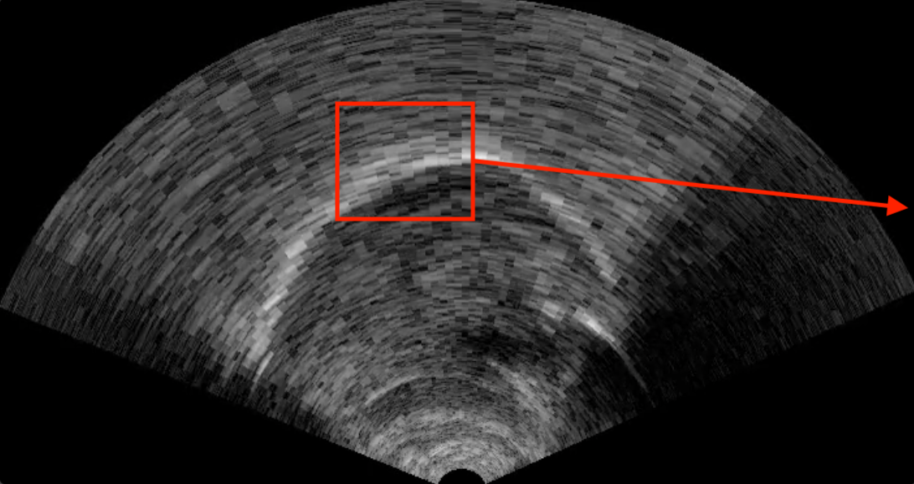
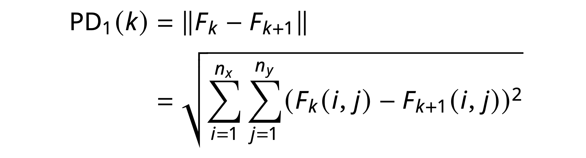
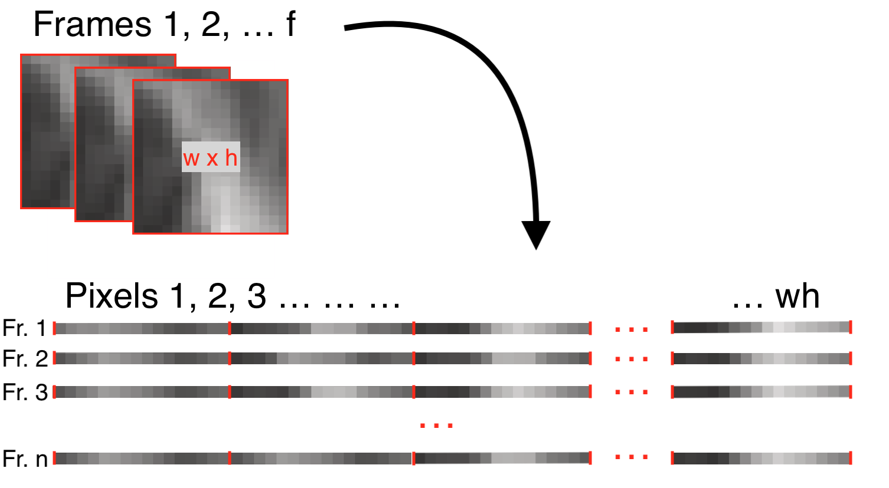
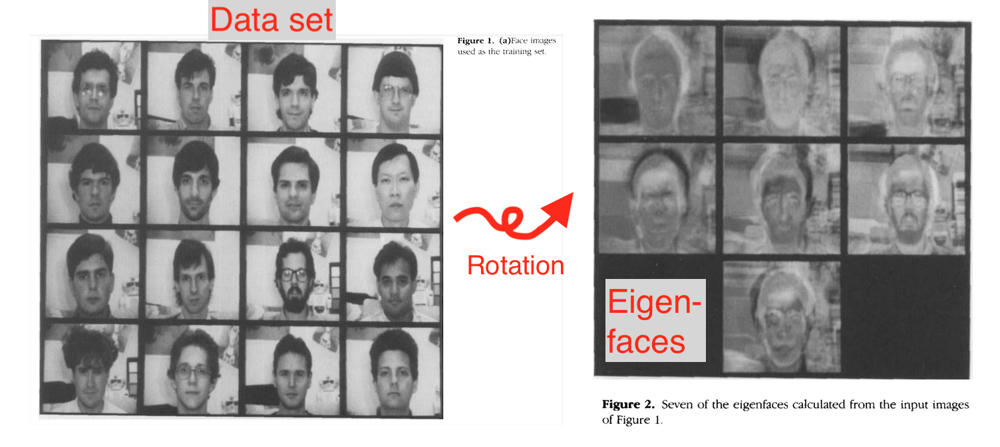
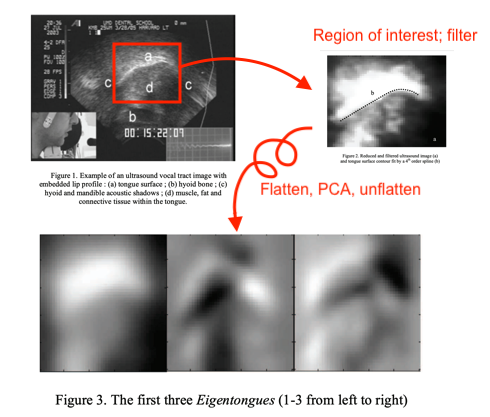
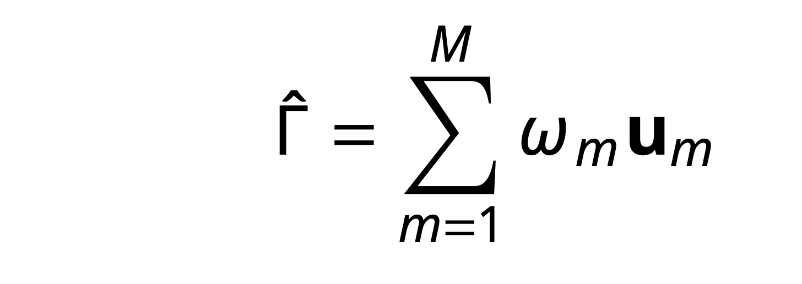
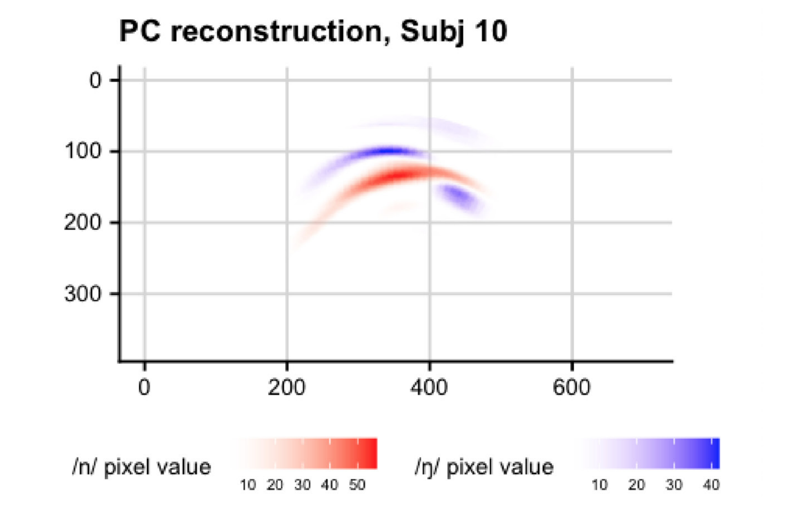

% "Pixel methods" for ultrasound
% Matthew Faytak University at Buffalo NTU invited workshop
%   

## Refresher: contour extraction

Contours can be extracted from the ultrasound image using a combination of human-generated hints and automatic processing Iskarous (2005); Stone (2005)

## Refresher: ultrasound data analysis

Usually done on **contours** with a spline model which can handle non-linear patterns (like tongue shapes) Davidson (2006); Heyne et al (2019)

* SSANOVA (smoothing spline ANOVA), pictured below
* GAMMs
* Both quite computationally intensive

figure from Weller et al. (to appear)

## Overview: this lecture

Various types of **feature engineering**

* Generating new features from existing ones
* Often through recombination, averaging, etc.

All get around feature extraction and the need for (most) human intervention by focusing on image's **pixels** as a set of features

* Pixel difference methods
* Optical flow
* Dimensionality reduction on ultrasound frames
	* Our focus here and in our final notebook

# Pixel-based motion detection

## Pixels

Each ultrasound image is composed of tens of thousands of pixels, each of which has a numerical value indicating brightness

* Directly relates to position of tongue: brightness means reflectivity

## Pixel shape

The pixels are *arc-shaped* in most ultrasound frames because the raw reflection data is stored as a rectangular grid Wrench & Scobbie (2008); Eshky et al (2021)

* Column = **scan line** (the energy/reflection of one element in probe)
* Row = distance from probe
* Color = reflectivity

This grid is transformed to real-world proportions before we work with it figure from Eshky et al (2021)

## Pixel difference (PD)

Tongue position *change* means pixels change in brightness from frame to frame

* Some pixels gain brightness as tongue moves into their region
* Others lose brightness as tongue moves away

The **Euclidean distance** of two frames in terms of all their pixels can be used as a measure of tongue movement figure from Palo (2019)

## Definition

Defining PD more precisely Palo (2019):

* Each frame $F$ is an $n_x \times n_y$ dimensional vector, where $n_x$ is scanlines and $n_y$ is pixels per scanline

* For $k = \{F_1, F_2, \ldots F_{n-1}\}$

## Step size

We can calculate the difference over successive frames (step size 1), or over frames more separated in time (step size $L$)

* for $k = \{F_1, F_2, \ldots F_{n-L}\}$

* The time associated with this measurement is the average of the time of the two involved frames, or $1/2(t_{F_k} + t_{F_{k+L}})$

Palo (2019) mainly uses a step size of 1

* Though depending on the articulation at issue, larger step sizes may be appropriate

## Applications of PD

Movement detected includes *intrinsic tongue muscles*, unlike other measures discussed so far

* Measures more than just movement in the surface contour
* Can even detect a speaker's heart rate (pulse in vessels in the tongue)

Various psycholinguistic applications McMillan &
Corley (2010); Palo (2019)

* Useful for detection of pre-speech articulation which may not be represented in the acoustic signal
* Refinement of reaction times based on production

## Optical flow (OF)

Related but more computationally complex: **optical flow**, which detects apparent motion between two frames Horn & Schunck (1981)

* Like PD, detects  magnitude of motion; unlike PD, gives *direction* of motion as well
* Produces a **flow field** for smaller elements in image, which can be averaged to a **consensus** figure from Faytak, Moisik, & Palo (2021)

## Applications of OF

Integrating the velocity signal  gives amount of displacement for rigid bodies (i.e. the larynx)  Moisik et al (2014); figure from Faytak, Moisik & Palo (2021)

# Pixel dimensionality reduction

## Pixel dimensionality reduction

Dimensionality reduction carried out not on ultrasound contours, but on entire **ultrasound frames**

* Ultrasound frames are made up of tens of thousands of individual pixels
* Each with a value indicating brightness (e.g. 0=black, 255=white)

Brightness values can be used as raw data for dimensionality reduction

## Pixels and scan lines

Each ultrasound frame can be thought of as a matrix of width $w$ by height $h$

* $w,h$ values must be fixed throughout data collection (images must be same size)
* Each column of pixels of shape $1 \times h$ represents a single **scan line** from the probe
* Each scan line is reflectivity data from a single element in the probe

## High dimensionality

Each pixel at location $x,y$ across data sets with the same frame size $w \times h$ can be thought of as a separate feature

* Meaning: each frame contains thousands, or tens of thousands, of features

Challenge for **feature selection**: 

* Bad idea to use every single pixel (curse of dimensionality)
* Not easy to pick a small number of pixels which are good predictors of the phenomenon we're studying
* Solution: **engineer new features** which capture the variation

## Recap: dimensionality reduction

PCA outputs **eigenvectors** and **eigenvalues**

* Eigenvectors (PCs) are patterns of variation uncovered in the data
* Eigenvalues assign importance to explaining variation in the data
* Observations can be transformed from naive basis into "PC space"

We might recall this was applied to numerous acoustic measures in our first notebook

Eigenvector loadings:

Data in PC space:

## Calculating image eigenvectors

Method can be extended to *image data*: pixels in an image of shape $w \times h$ are treated as a *very long list* of features of length $wh$

* Basically, rows or columns are "unstacked" and "put end to end" to form a list 

Like in the notebook's dataframe:

* Each row in the dataframe is an observation (i.e. an ultrasound frame)
* Each column in the dataframe is a feature (pixel in a given location)
* The difference: *many more* columns/features

## Eigenvectors as eigenpictures

Convert our length $wh$ eigenvectors back to $w \times h$ grids to get impact of associated PCs on pixel brightness *in physical space* Sirovich & Kirby (1987)

* Help us to evaluate what the discovered dimensions are
* Famously applied to faces; eigenvectors converted back to original dimensions are called **eigenfaces** Turk & Pentland (1991)
* Also applied to images of lips alone (eigenlips) Bregler & Konig (1994)

We could reshape our notebook's eigenvectors, but because feature number doesn't correspond to physical space, it doesn't really gain us anything

## Eigenfaces

When the features correspond to physical position (i.e. of pixels), eigenpictures tell us more: figures from Turk & Pentland (1991)

* We used red/blue diverging color scale in notebook; here white = positive, black = negative

Eigenfaces show variation in shape and size of facial features, hair, and setting (lighting, pose, etc)

* The most informative eigenfaces (PCs) mainly capture variation in hair and facial hair
* Along with glasses,  lighting, and probably skin tone

## Eigentongues

Hueber et al (2007) coined **eigentongues**, from eigenfaces

* Take the PC loadings obtained from our "flattened" frame data, and "unflatten" them

* Covariation of pixel brightness with PCs shows variation in *tongue contour* position
	* And any other patterns in data set (hyoid shadow position, internal musculature of tongue, ...)
* Here, higher PC1 "moves" upper part of contour to the right; lower PC1 "moves" it to the left

## Eigentongues

Another example, from *all* tongue postures in a corpus, at a lower spatial resolution figures from Hueber et al (2007)

* Again, white = positive covariation with PC score; black = negative 
* Higher PC1 score makes brighter pixels light up
* Lower PC1 score makes darker pixels light up

## PC scores

We can now characterize our ultrasound image data set in terms of the **PC scores** for each eigentongue

* Here, PC1 clearly identifies two clusters, each of which varies in PC2 and PC3

# Applications of eigentongues

## Feature engineering

On a practical level, avoids **feature selection** problems by making new ones; avoids time-consuming process of **contour extraction**

* Eigentongues capture informative variation across the set of images
* Most often, this is linguistically interesting (because most tongue motions have linguistic consequences)

We can also do some neat tricks with eigentongues which aren't easy with other approaches

* Reviewed in our final notebook
* ... but first, an overview here

## Time series of PC scores

*Sequences of frames* can be fed to PCA instead of frames at a single point of interest (i.e. midpoint); yields **time series** data Mielke et al (2017); Hoole & Pouplier (2017); Smith et al (2019)

* Here, simple case of PC1 capturing /i/ with high scores and /a/ at low scores figure from Hoole & Pouplier (2017)

 
* "Front-raising" coarticulation over time represented by full range of scores 

## Linear discriminant analysis

Another dimensionality-reduction technique which eigentongue PC scores can be submitted to see Carignan (2019)

* Learns new dimension(s) which maximizes separation of labeled categories
* LDA can be used as "segment detector" (i.e. discriminate /r/ vs. all other segments)
Mielke et al (2017); figure from Smith et al (2019)

* Can also be used to determine how consistent or discrete a contrast is (i.e. [l] vs. [lˠ]; /n/ vs. /ŋ/) Strycharczuk & Scobbie (2017); Faytak et al (2020)

## Reconstruction 

Weighted combinations of eigentongues can **reconstruct** observations Hoole & Pouplier (2017); Faytak et al. (2020)

Specifically, an image $\Gamma$ can be reconstructed as linear combination of $m$ eigentongues: Berry (2012)

where $u_m$ is the $m$th eigentongue and $\omega_m$ is the **projection** of $\Gamma$ onto the $m$th eigentongue (i.e. PC score)

## Reconstruction 

Creates a *denoised* version of the observation figures from Faytak et al. (2020) 

# Wrapping up

## Pixel methods: pros

Very efficient once the basics are mastered

* Speedy (big advantage over basic contour extraction) and replicable
* Avoids feature selection by engineering new ones
* Takes  information into account beyond tongue surface

Pixel methods easy to use on other data types

* MRI Oh & Lee (2018)
* Video of face, especially lips Krause et al (2020)

## Pixel methods: cons

Fairly different from some approaches to analysis

* More computationally involved than feature-selection methods
* Eigentongue methods primarily measure similarity and difference

Eigentongue analysis only works properly within single speakers 

* Size, frame of reference will bleed into PCs
* No automatic separation of linguistic and non-linguistic variation

## Up next: second notebook

Our final lecture will cover a Python implementation of eigentongue methods from my recent work

* Image preprocessing
* Carrying out PCA
* Interpreting eigentongues
* Using eigentongues for:
* Reconstruction of (mean) grouped data
* Linear discriminant analysis (LDA)

If you are curious about how to implement pixel difference or optical flow in Python:

* See the <a href="https://github.com/giuthas/satkit">SATKit</a> repo, which currently supports these methods (Palo et al. (2022)
* Faytak, Moisik & Palo (2021) describes planned  capabilities

## References {.bib}

Berry, J. (2012). Machine learning methods for articulatory data. Doctoral dissertation, University of Arizona. <a href="https://www.proquest.com/docview/1013994476">PDF</a> 

Bregler, C. & Konig, Y. (1994). "Eigenlips" for robust speech recognition. In *Proceedings of ICASSP '94 Vol. 2*. <a href="https://doi.org/10.1109/ICASSP.1994.389567">DOI</a>

Danilouchkine, M., Mastik, F. & van der Steen, A. (2009). A study of
coronary artery rotational motion with dense scale-space optical
flow in intravascular ultrasound. *Physics in Medicine and Biology*,
54(6), 1397–1418. <a href="https://doi.org/10.1088/0031-9155/54/6/002">DOI</a>

Carignan, C. (2019). TRACTUS (Temporally Resolved Articulatory Configuration Tracking
of Ultrasound). Software. <a href="https://github.com/ChristopherCarignan/TRACTUS">GitHub</a>

Davidson, L. (2006). Comparing tongue shapes from ultrasound imaging using
smoothing spline analysis of variance. *The Journal of the Acoustical Society of
America*, 120, pp. 407–415. <a href="https://doi.org/10.1121/1.2205133">DOI</a>

Eshky, A., Cleland, J., Ribeiro, M., Sugden, E., Richmond, K. & Renals, S. (2021). Automatic audiovisual synchronisation for ultrasound tongue imaging. *Speech Communication*, 132, 83-95. <a href="https://doi.org/10.1016/j.specom.2021.05.008">DOI</a>

Faytak, M., Moisik, S. & Palo, P. (2021). The Speech Articulation Toolkit (SATKit): Ultrasound image analysis in Python. In *Proceedings of ISSP 12*, 234-237. <a href="https://issp2020.yale.edu/ProcISSP2020.pdf">PDF</a> 

Faytak, M., Liu, S. & Sundara, M. (2020). Nasal coda neutralization in Shanghai Mandarin: Articulatory and perceptual evidence. *Laboratory Phonology*, 11(1), 23. <a href="https://doi.org/10.5334/labphon.269">DOI</a>

Heyne, M., Derrick, D., & Al-Tamimi, J. (2019). Native language influence on brass instrument performance: An application of generalized additive mixed models (GAMMs) to midsagittal ultrasound images of the tongue. *Frontiers in Psychology*, 2597. <a href="https://doi.org/10.3389/fpsyg.2019.02597">DOI</a>

Hoole, P. & Pouplier, M. (2017). Öhman returns: New horizons in the collection and analysis of imaging data in speech production research. *Computer Speech & Language*, 45, 253-277. <a href="https://doi.org/10.1016/j.csl.2017.03.002">DOI</a>

Horn, B., & Schunck, B. (1981). Determining optical flow. *Artificial
Intelligence*, 17(1), 185–203. <a href="https://doi.org/10.1016/0004-3702(81)90024-2">DOI</a>

Hueber, T., Aversano, G., Chollet, G., Denby, B., Dreyfus, G., Oussar, Y., Roussel, P. & Stone, M. (2007). Eigentongue feature extraction for an ultrasound-based silent speech interface. In *Proceedings of ICASSP '07 Vol. 1*.
<a href="https://doi.org/10.1109/ICASSP.2007.366140">DOI</a>

Iskarous, K. (2005). Detecting the edge of the tongue: A tutorial. *Clinical Linguistics & Phonetics*, 19(6-7), 555-565. <a href="https://doi.org/10.1080/02699200500113871">DOI</a>

Krause, P., Kay, C. & Kawamoto, A., (2020) Automatic motion tracking of lips using digital video and OpenFace 2.0, *Laboratory Phonology* 11(1), 9. <a href="https://doi.org/10.5334/labphon.232">DOI</a>

McMillan, C. & Corley, M. (2010). Cascading influences on the
production of speech: Evidence from articulation. *Cognition*,
117(3), 243–260. <a href="https://doi.org/10.1016/j.cognition.2010.08.019">DOI</a>

Mielke, J., Carignan, C. & Thomas, E. (2017). The articulatory dynamics of pre-velar and pre-nasal /æ/-raising in English: An ultrasound study. *The Journal of the Acoustical Society of America*, 142(1), 332-349. <a href="https://doi.org/10.1121/1.4991348">DOI</a>

Moisik, S., Lin, H., & Esling, J. (2014). A study of laryngeal
gestures in Mandarin citation tones using simultaneous
laryngoscopy and laryngeal ultrasound (SLLUS). *JIPA*, 44(1), 21–
58. <a href="https://doi.org/10.1017/S0025100313000327">DOI</a>

Oh, M., & Lee, Y. (2018). ACT: An Automatic Centroid Tracking tool for analyzing vocal tract actions in real-time magnetic resonance imaging speech production data. *The Journal of the Acoustical Society of America*, 144(4), EL290-EL296. <a href="https://doi.org/10.1121/1.5057367">DOI</a>

Palo, P. (2019). Measuring pre-speech articulation. Doctoral dissertation, Queen Margaret University. <a href="https://eresearch.qmu.ac.uk/handle/20.500.12289/10163">PDF</a>

Palo, P., Moisik, S. & Faytak, M. (2022). Speech Articulation Toolkit (SATKit). Software. <a href="https://github.com/giuthas/satkit">GitHub</a>

Smith, B., Mielke, J., Magloughlin, L. & Wilbanks, E. (2019) Sound change and coarticulatory variability involving English /ɹ/. *Glossa: A Journal of General Linguistics* 4(1), 63. <a href="https://doi.org/10.5334/gjgl.650">DOI</a>

Stone, M. (2005). A guide to analysing tongue motion from ultrasound images. *Clinical Linguistics & Phonetics*, 19(6-7), 455-501. <a href="https://doi.org/10.1080/02699200500113558">DOI</a>

Strycharczuk, P. & Scobbie, J. (2017). Whence the fuzziness? Morphological effects in interacting sound changes in Southern British English. *Laboratory Phonology* 8(1), 7. <a href="http://doi.org/10.5334/labphon.24">DOI</a>

Turk, M. & Pentland, A. (1991).  Eigenfaces for recognition. *Journal of Cognitive Neuroscience*, 3(1), 71-86. <a href="https://doi.org/10.1162/jocn.1991.3.1.71">DOI</a>

Weller, J., Faytak, M., Steffman, J., Mayer, C., Teixeira, G. & Tankou, R. (to appear). Supralaryngeal articulation across voicing and aspiration in Yemba vowels. In *Proceedings of ACAL 51/52*. 

Wrench, A., & Scobbie, J. (2008). High-speed cineloop ultrasound vs. video ultrasound tongue imaging: Comparison of front and back lingual gesture location and relative timing. In *Proceedings of ISSP 8*. <a href="https://eresearch.qmu.ac.uk/handle/20.500.12289/2012">PDF</a>
